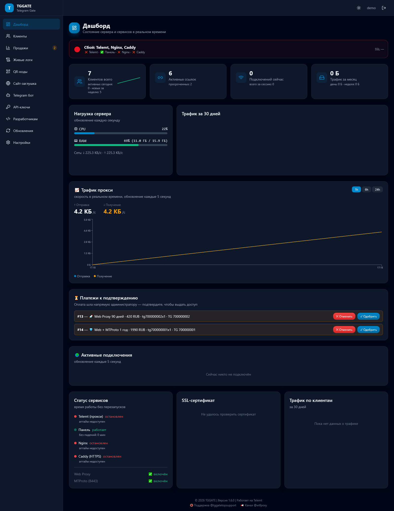
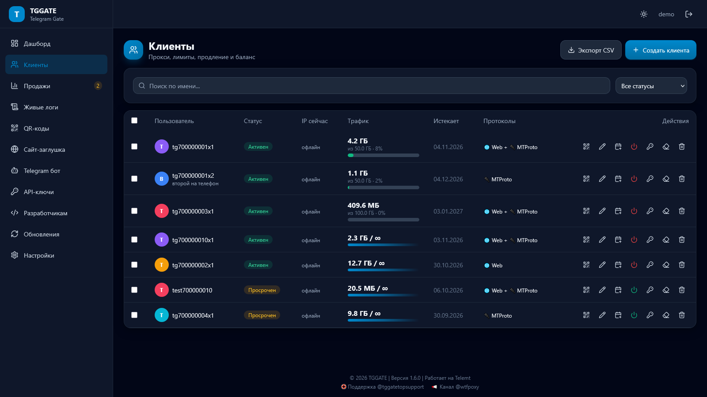
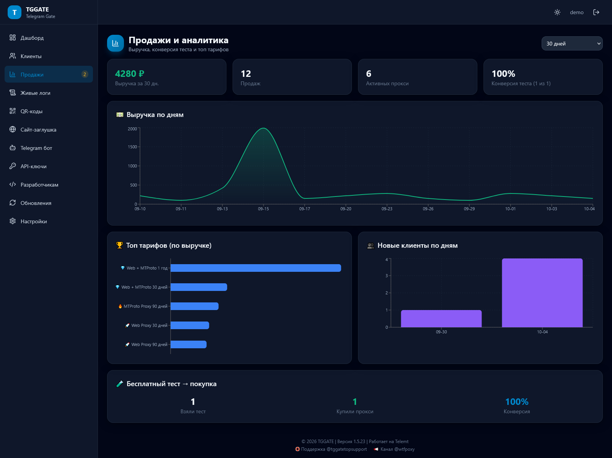
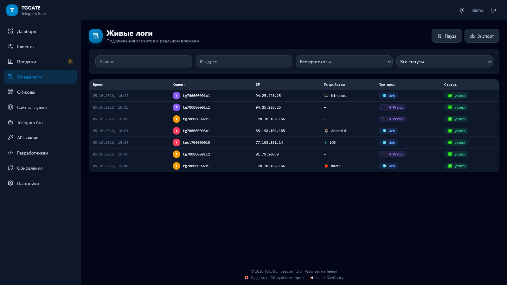
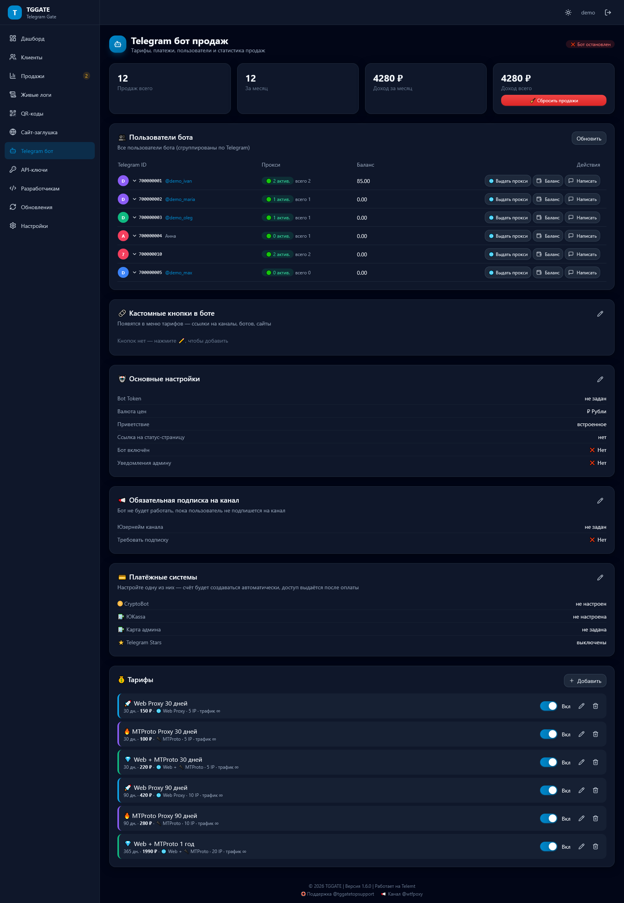
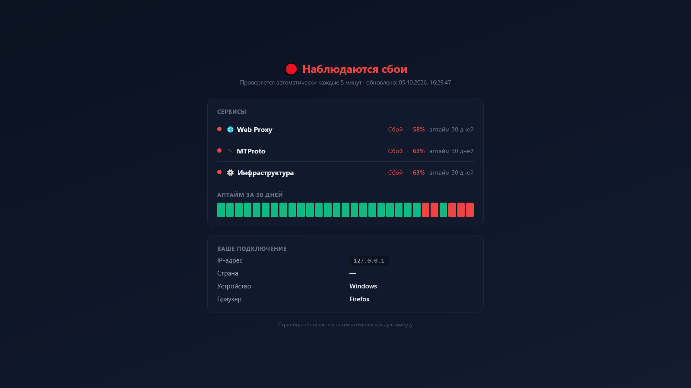

<p align="center">
  <h1 align="center">🚀 TGGATE — Telegram Gate</h1>
  <p align="center">
    Панель управления Telegram-прокси: <b>Web Proxy</b> и <b>MTProto</b> через единый сервер <b>Telemt</b> —
    с ботом продаж, аналитикой, автопродлением и автообновлениями.
  </p>
  <p align="center">
    <a href="https://github.com/Therealwh/Web-Proxy-Telegram-Panel-TG-BOT/releases/latest"></a>
    <a href="LICENSE"></a>
    <a href="https://github.com/Therealwh/Web-Proxy-Telegram-Panel-TG-BOT/actions/workflows/ci.yml"></a>
    
  </p>
</p>

## 📑 Содержание

- [✨ Возможности](#-возможности)
- [📸 Скриншоты](#-скриншоты)
- [⚡ Быстрая установка](#-быстрая-установка)
- [🤖 Telegram-бот продаж](#-telegram-бот-продаж)
- [🛠 Управление](#-управление)
- [🔄 Обновления](#-обновления)
- [🌐 Протоколы](#-протоколы)
- [❤️ Поддержать проект](#️-поддержать-проект)
- [📚 Документация](#-документация)

## ✨ Возможности

| | |
|---|---|
| 🤖 **Бот продаж** | Тарифы, 5 способов оплаты (баланс, CryptoBot, ЮKassa, ⭐ Stars, карта), кабинет с кнопками подключения, автопродление, рефералка, тест 3 часа |
| 📊 **Аналитика** | Выручка по дням, топ тарифов, конверсия теста, новые клиенты |
| 🟢 **Надёжность** | Мониторинг сервисов с алертами, публичная статус-страница, автобэкап базы в Telegram |
| 🌐 **Для клиентов** | QR-коды, веб-кабинет без бота, инструкции подключения, iOS-подсказки |
| 🔌 **Для разработчиков** | Публичный API, Swagger UI, вебхуки с HMAC, примеры Python/Node.js |
| 🔄 **Обслуживание** | Автообновления с живым статус-баром, смена домена из панели, сайт-заглушка с SEO |

- **Панель TGGATE**: https://github.com/Therealwh/Web-Proxy-Telegram-Panel-TG-BOT
- **Telemt** (прокси-сервер): https://github.com/telemt/telemt

## ⚡ Быстрая установка

Требования: чистый VPS с **Ubuntu 22.04 / 24.04**, root-доступ, домен с A-записью на IP сервера.

```bash
apt-get -o DPkg::Lock::Timeout=600 update && \
apt-get -o DPkg::Lock::Timeout=600 install -y curl ca-certificates git && \
bash -c "$(curl -fsSL --proto '=https' --tlsv1.2 \
  https://raw.githubusercontent.com/Therealwh/Web-Proxy-Telegram-Panel-TG-BOT/main/install.sh)"
```

Установщик интерактивно спросит:

| Параметр | Описание |
|---|---|
| 🌐 Домен | Например, `proxy.example.com` (A-запись должна указывать на сервер) |
| 📧 Email | Для SSL-сертификата Let's Encrypt |
| 👤 Логин | Логин администратора (латиница) |
| 🔑 Пароль | Минимум 8 символов, буквы + цифры |
| 🌍 IP | Внешний IP (определяется автоматически) |

После установки вы получите адрес панели с секретным путём:
`https://ваш-домен/cp-xxxxxx/`

## 🤖 Telegram-бот продаж

Тарифы с ценами и лимитами (IP, трафик), выдача ссылок после оплаты,
уведомления админу, статистика продаж. Админка в самом боте: `/admin` —
дашборд, подтверждение платежей, рассылки.

**Способы оплаты:** баланс, CryptoBot, ЮKassa, ⭐ Telegram Stars
(автоконверт цены по курсу), карта админа (СБП) с приёмом чеков.

**Личный кабинет:** все прокси клиента — под каждым кнопки
«🌐 Подключить ВЕБ прокси» / «🔌 Подключить MTProto прокси» (по купленным
протоколам) и «♻️ Продлить». Продление прокси с двумя протоколами
(например, тестового) предлагает выбор: только Web / только MTProto / оба.
**Автопродление с баланса** — включается клиентом одним нажатием.
Плюс пополнение баланса, рефералка и пошаговые инструкции «📱 Как подключить».

**Веб-кабинет:** ссылка `/p/{токен}` приходит с каждой покупкой — клиент
видит прокси и продлевает с оплатой прямо в браузере, даже если удалил бота.

**Пользователи бота в панели:** все, кто писал боту (не только купившие),
рядом с Telegram ID — @username; выдача баланса, выдача прокси и рассылка в один клик.
Обязательная подписка на канал (вкл/выкл), тестовый доступ на 3 часа.

**Надёжность:** автобэкап базы в Telegram, мониторинг MTProto/Web/Telemt
с алертами в бот, публичная страница статуса (`STATUS_DOMAIN`), iOS-подсказки
при подключении.

<details>
<summary><b>📊 Остальные возможности панели</b> (дашборд, клиенты, логи, сайт, API)</summary>

### Дашборд
Нагрузка CPU/RAM/сеть в реальном времени (WebSocket), счётчики клиентов
и подключений, трафик за день/неделю/месяц, статусы сервисов, срок SSL.

### Клиенты
Квоты трафика с прогресс-баром, дата истечения, лимит IP, ограничение
скорости, Ad Tag, выбор протоколов (Web Proxy / MTProto), CSV импорт/экспорт,
массовое создание и массовые действия, перевыпуск ссылок.

### Живые логи
Подключения в реальном времени, фильтры по клиенту/IP/протоколу,
устройства клиентов (Windows/macOS/iOS/Android), цветовая разметка (✅/❌/⚠️), экспорт за период.

### QR-коды
QR для Web Proxy и MTProto, PNG/SVG, кастомизация цветов и размера,
публичная страница `/qr/{id}`, статистика сканирований, отправка в Telegram.

### Сайт-заглушка
Встроенный файловый менеджер и редактор кода, 3 готовых шаблона
(🔧 ремонт с анимацией, 🚗 автомобили, 💄 женский портал), SEO-поля,
предпросмотр. Домен выглядит как обычный сайт.

### Публичный API
API-ключи с разделением прав, Swagger UI на `/panel-api/docs`, вебхуки
с HMAC-подписью, примеры для Python и Node.js. Создание клиентов
со всеми лимитами (IP, скорости, трафик), ссылки, QR, продление.

</details>

## 📸 Скриншоты

| Дашборд | Клиенты |
|---|---|
|  |  |

| Продажи и аналитика | Живые логи |
|---|---|
|  |  |

| Telegram-бот | Статус сервиса |
|---|---|
|  |  |

Полная галерея всех 13 разделов (вход, QR-коды, сайт, API-ключи, разработчики, обновления, настройки, светлая тема) — в [docs/SCREENSHOTS.md](docs/SCREENSHOTS.md).

## 🛠 Управление

```bash
sudo TGGATE
```

Меню: статус сервисов, старт/стоп/рестарт, логи, смена логина/пароля,
смена домена, обновления, бэкап/восстановление, удаление.

## 🔄 Обновления

### Автоматические
Панель проверяет обновления с заданной частотой
(Настройки → Обновления). Каналы: stable / beta / latest.

### Ручные
- Через панель: **Обновления → Обновить панель / Обновить Telemt**
- Через консоль: `sudo TGGATE` → пункты 8/9/10

### Откат
При неудачном обновлении панель автоматически откатывается на бэкап.
Бэкапы хранятся в `/var/backups/tggate/`.

## 🌐 Протоколы

| Протокол | Порт | Ссылка |
|---|---|---|
| Web Proxy | 443 (через домен) | `tg://webproxy?server=...&secret=dd...` |
| MTProto (Fake TLS) | 8443 | `tg://proxy?server=...&port=8443&secret=ee...` |

## 🔧 Troubleshooting

| Проблема | Решение |
|---|---|
| Панель не открывается | Проверьте секретный путь и `sudo TGGATE` → статус |
| SSL не выпускается | Убедитесь, что A-запись домена указывает на IP сервера |
| MTProto не подключается | `sudo ufw status` — порт 8443 должен быть открыт |
| Telemt упал | `journalctl -u telemt -n 100` |

## ❤️ Поддержать проект

TGGATE развивается одним человеком в свободное время. Если панель приносит
вам доход или просто нравится — поддержите разработку любой суммой 🙏
Каждое пожертвование идёт на серверы, домены и новые функции.

| Валюта | Сеть | Адрес |
|---|---|---|
| USDT | TRC-20 | `TGWtYdfLEVEVXScaE4Ut7ornk1A3CXCCfe` |
| TRX | TRON | `TGWtYdfLEVEVXScaE4Ut7ornk1A3CXCCfe` |
| USDT | TON | `UQCGYVM9hg2JcqnEQpTPibPxHUuSOB03zhaSE8Yn-C2aHlH-` |
| GRAM | TON | `UQCGYVM9hg2JcqnEQpTPibPxHUuSOB03zhaSE8Yn-C2aHlH-` |
| BNB | Smart Chain (BEP-20) | `0xde5a28A77359cdCf32666Db8Aae5f5Bb13c5f886` |

> Адреса кликабельны для копирования. Спасибо! 💙

## 📚 Документация

- [Скриншоты панели](docs/SCREENSHOTS.md)
- [Установка](docs/INSTALL.md)
- [API панели](docs/API.md)
- [Публичный API](docs/API_PUBLIC.md)
- [Telegram-бот](docs/BOT.md)
- [Telemt и протоколы](docs/TELEMT.md)
- [QR-коды](docs/QR_CODES.md)
- [Сайт-заглушка](docs/WEBSITE.md)
- [Для разработчиков](docs/DEVELOPERS.md)

## 📄 Лицензия

MIT © 2026 TGGATE
