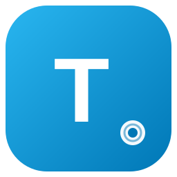

<p align="center">
  <b>English</b> · <a href="README.md">Русский</a>
</p>

<p align="center">
  
  <h1 align="center">🚀 TGGATE — Telegram Gate</h1>
  <p align="center">
    Telegram proxy control panel: <b>Web Proxy</b> and <b>MTProto</b> on a single <b>Telemt</b> server —
    with a sales bot, analytics, auto-renewal and auto-updates.
  </p>
  <p align="center">
    <a href="https://github.com/Therealwh/Web-Proxy-Telegram-Panel-TG-BOT/releases/latest"></a>
    <a href="LICENSE"></a>
    <a href="https://github.com/Therealwh/Web-Proxy-Telegram-Panel-TG-BOT/actions/workflows/ci.yml"></a>
    
  </p>
</p>

## 📑 Contents

- [✨ Features](#-features)
- [📸 Screenshots](#-screenshots)
- [⚡ Quick install](#-quick-install)
- [🤖 Telegram sales bot](#-telegram-sales-bot)
- [🛠 Management](#-management)
- [🔄 Updates](#-updates)
- [🌐 Protocols](#-protocols)
- [❤️ Support the project](#️-support-the-project)
- [📚 Documentation](#-documentation)

## ✨ Features

| | |
|---|---|
| 🤖 **Sales bot** | Tariffs, 5 payment methods (balance, CryptoBot, YooKassa, ⭐ Telegram Stars, manual card), connection buttons in user cabinet, auto-renewal, referrals, free 3-hour trial |
| 📊 **Analytics** | Revenue by day, top tariffs, trial-to-paid conversion |
| 🟢 **Reliability** | Service monitoring with bot alerts, public status page, automatic DB backups to Telegram |
| 🌐 **For clients** | QR codes, web cabinet that works without the bot, setup guides, iOS hints |
| 🔌 **For developers** | Public API, Swagger UI, webhooks with HMAC, Python/Node.js examples |
| 🔄 **Maintenance** | Auto-updates with live progress bar, domain change from the panel, decoy website with SEO |

- **TGGATE panel**: https://github.com/Therealwh/Web-Proxy-Telegram-Panel-TG-BOT
- **Telemt** (proxy server): https://github.com/telemt/telemt

## ⚡ Quick install

Requirements: clean VPS with **Ubuntu 22.04 / 24.04**, root access, domain with A-record pointing to the server IP.

```bash
apt-get -o DPkg::Lock::Timeout=600 update && \
apt-get -o DPkg::Lock::Timeout=600 install -y curl ca-certificates git && \
bash -c "$(curl -fsSL --proto '=https' --tlsv1.2 \
  https://raw.githubusercontent.com/Therealwh/Web-Proxy-Telegram-Panel-TG-BOT/main/install.sh)"
```

The installer will interactively ask for:

| Parameter | Description |
|---|---|
| 🌐 Domain | E.g. `proxy.example.com` (A-record must point to the server) |
| 📧 Email | For the Let's Encrypt SSL certificate |
| 👤 Login | Administrator login (latin letters) |
| 🔑 Password | Minimum 8 characters, letters + digits |
| 🌍 IP | External IP (auto-detected) |

After installation you will get the panel address with a secret path:
`https://your-domain/cp-xxxxxx/`

## 🤖 Telegram sales bot

Tariffs with prices and limits (IPs, traffic), link delivery after payment,
admin notifications, sales statistics. Admin panel inside the bot: `/admin` —
dashboard, payment confirmations, broadcasts.

**Payment methods:** balance, CryptoBot, YooKassa, ⭐ Telegram Stars
(auto-converted price), manual admin card (SBP) with receipt checks.

**User cabinet:** all client proxies — under each proxy the buttons
«🌐 Connect WEB proxy» / «🔌 Connect MTProto proxy» (per purchased
protocols) and «♻️ Renew». Renewing a dual-protocol proxy (e.g. a trial one)
offers a choice: Web only / MTProto only / both.
**Auto-renewal from balance** — enabled by the client in one tap.
Plus balance top-up, referrals and step-by-step «📱 How to connect» guides.

**Web cabinet:** the `/p/{token}` link arrives with every purchase — the client
views proxies and renews with payment right in the browser, even if they deleted the bot.

**Bot users in the panel:** everyone who wrote to the bot (not only buyers),
@username next to the Telegram ID; balance top-up, proxy issuance and messaging in one click.
Mandatory channel subscription (on/off), free 3-hour trial.

**Reliability:** automatic DB backups to Telegram, MTProto/Web/Telemt monitoring
with bot alerts, public status page (`STATUS_DOMAIN`), iOS connection hints.

<details>
<summary><b>📊 Other panel features</b> (dashboard, clients, logs, website, API)</summary>

### Dashboard
Real-time CPU/RAM/network load (WebSocket), client and connection counters,
traffic per day/week/month, service statuses, SSL expiry.

### Clients
Traffic quotas with progress bars, expiry dates, IP limits, speed limits,
Ad Tag, protocol choice (Web Proxy / MTProto), CSV import/export,
bulk creation and bulk actions, link re-issuing.

### Live logs
Real-time connections, filters by client/IP/protocol,
client devices (Windows/macOS/iOS/Android), color coding (✅/❌/⚠️), period export.

### QR codes
QR for Web Proxy and MTProto, PNG/SVG, color and size customization,
public `/qr/{id}` page, scan statistics, sending to Telegram.

### Decoy website
Built-in file manager and code editor, 3 ready templates
(🔧 repair with animation, 🚗 cars, 💄 women's portal), SEO fields,
preview. The domain looks like an ordinary website.

### Public API
API keys with permission separation, Swagger UI at `/panel-api/docs`, webhooks
with HMAC signature, examples for Python and Node.js. Client creation
with all limits (IPs, speeds, traffic), links, QR, renewal.

</details>

## 📸 Screenshots

| Dashboard | Clients |
|---|---|
|  |  |

| Sales & analytics | Live logs |
|---|---|
|  |  |

| Telegram bot | Service status |
|---|---|
|  |  |

Full gallery of all 13 sections (login, QR codes, website, API keys, developers, updates, settings, light theme) — in [docs/SCREENSHOTS.md](docs/SCREENSHOTS.md) (captions in Russian).

## 🛠 Management

```bash
sudo TGGATE
```

Menu: service status, start/stop/restart, logs, login/password change,
domain change, updates, backup/restore, uninstall.

## 🔄 Updates

### Automatic
The panel checks for updates at the configured frequency
(Settings → Updates). Channels: stable / beta / latest.

### Manual
- Via panel: **Updates → Update panel / Update Telemt**
- Via console: `sudo TGGATE` → items 8/9/10

### Rollback
On a failed update the panel automatically rolls back to a backup.
Backups are stored in `/var/backups/tggate/`.

## 🌐 Protocols

| Protocol | Port | Link |
|---|---|---|
| Web Proxy | 443 (via domain) | `tg://webproxy?server=...&secret=dd...` |
| MTProto (Fake TLS) | 8443 | `tg://proxy?server=...&port=8443&secret=ee...` |

## 🔧 Troubleshooting

| Problem | Solution |
|---|---|
| Panel doesn't open | Check the secret path and `sudo TGGATE` → status |
| SSL is not issued | Make sure the domain A-record points to the server IP |
| MTProto doesn't connect | `sudo ufw status` — port 8443 must be open |
| Telemt is down | `journalctl -u telemt -n 100` |

## ❤️ Support the project

TGGATE is developed by one person in their free time. If the panel brings
you income or you just like it — support development with any amount 🙏
Every donation goes to servers, domains and new features.

Click the copy icon in the top-right corner of an address block.

**USDT — TRC-20**
```
TGWtYdfLEVEVXScaE4Ut7ornk1A3CXCCfe
```

**TRX — TRON**
```
TGWtYdfLEVEVXScaE4Ut7ornk1A3CXCCfe
```

**USDT — TON**
```
UQCGYVM9hg2JcqnEQpTPibPxHUuSOB03zhaSE8Yn-C2aHlH-
```

**GRAM — TON**
```
UQCGYVM9hg2JcqnEQpTPibPxHUuSOB03zhaSE8Yn-C2aHlH-
```

**BNB — Smart Chain (BEP-20)**
```
0xde5a28A77359cdCf32666Db8Aae5f5Bb13c5f886
```

> Thank you! 💙

## 📚 Documentation

Most docs are in Russian for now:

- [Panel screenshots](docs/SCREENSHOTS.md)
- [Installation](docs/INSTALL.md)
- [Panel API](docs/API.md)
- [Public API](docs/API_PUBLIC.md)
- [Telegram bot](docs/BOT.md)
- [Telemt and protocols](docs/TELEMT.md)
- [QR codes](docs/QR_CODES.md)
- [Decoy website](docs/WEBSITE.md)
- [For developers](docs/DEVELOPERS.md)

## 📄 License

MIT © 2026 TGGATE
