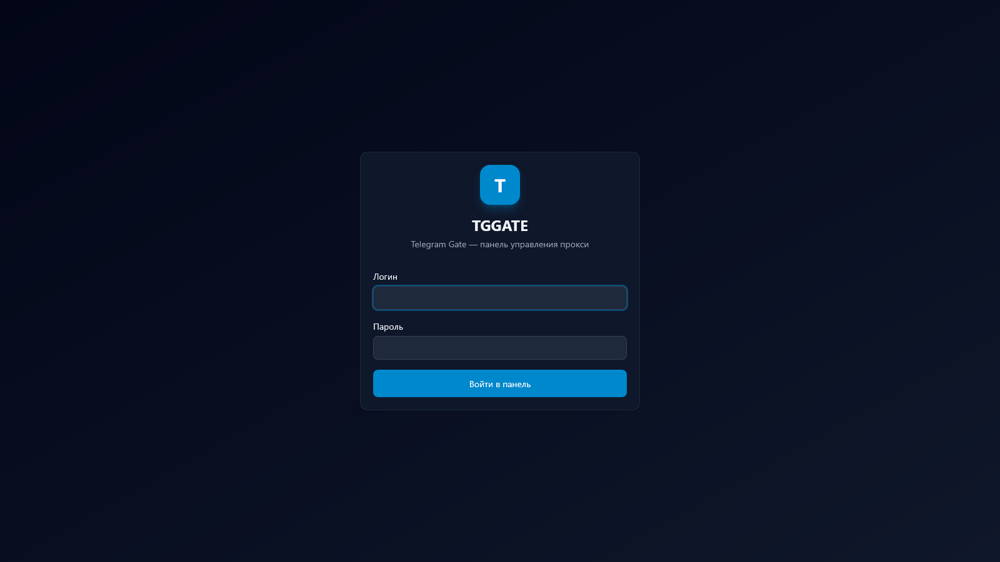
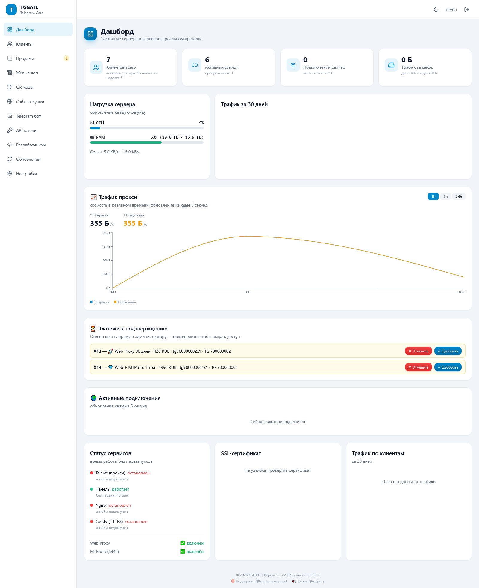
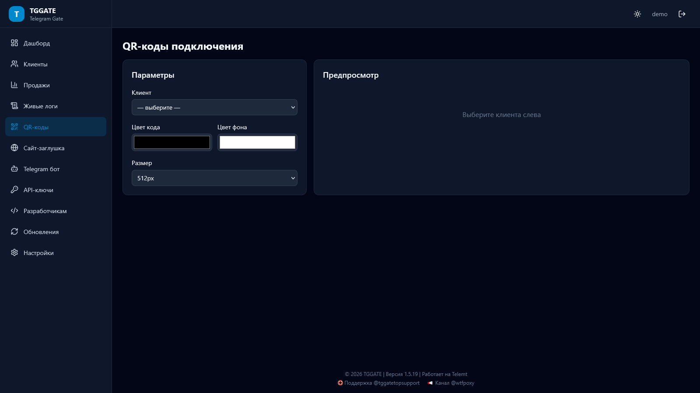
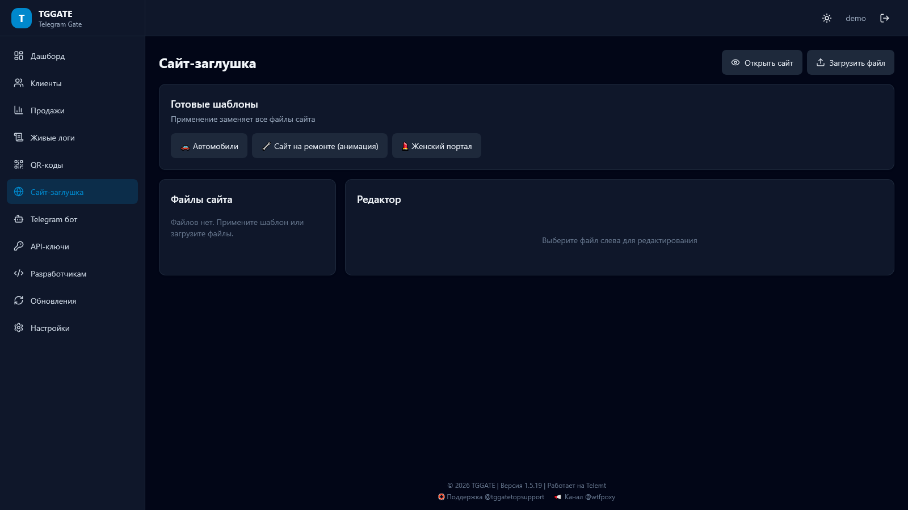
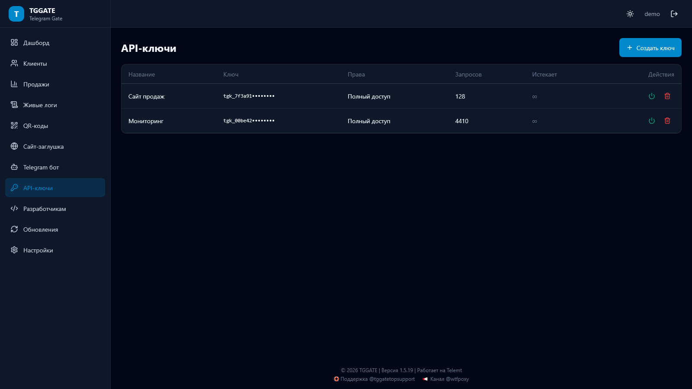
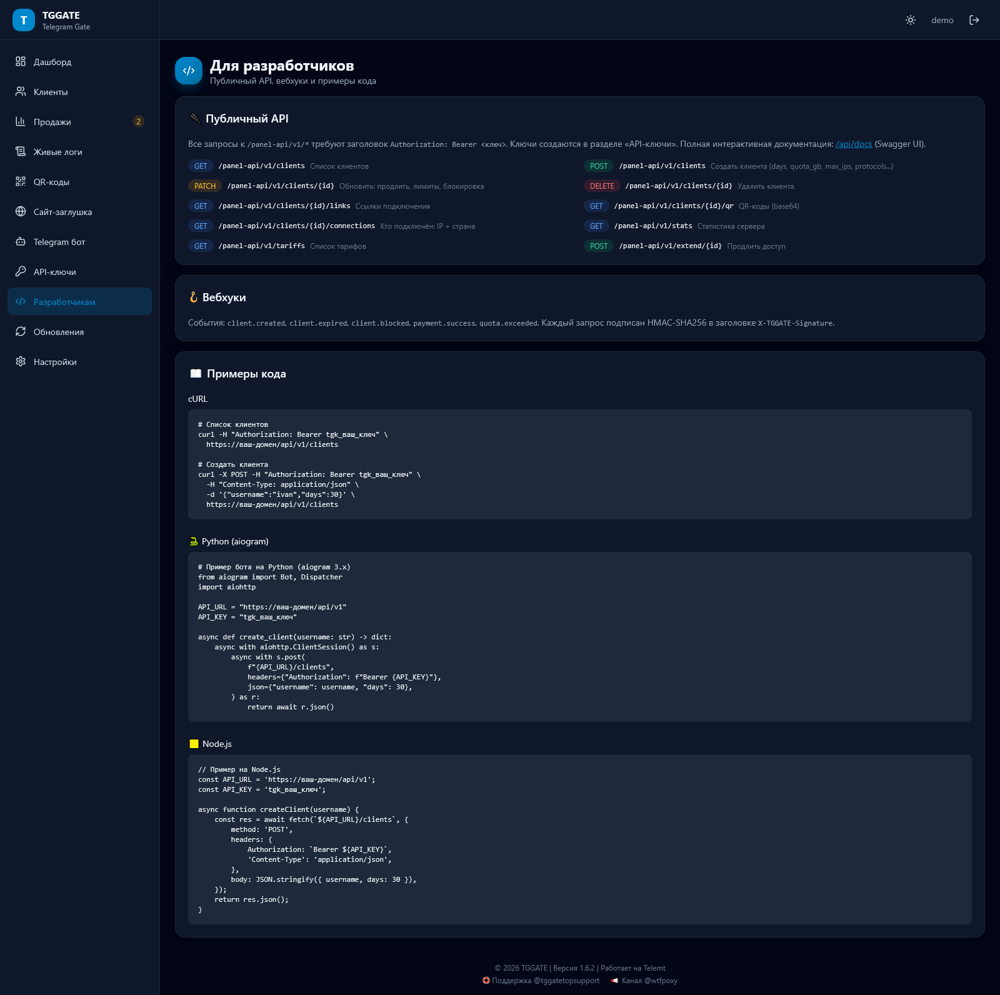
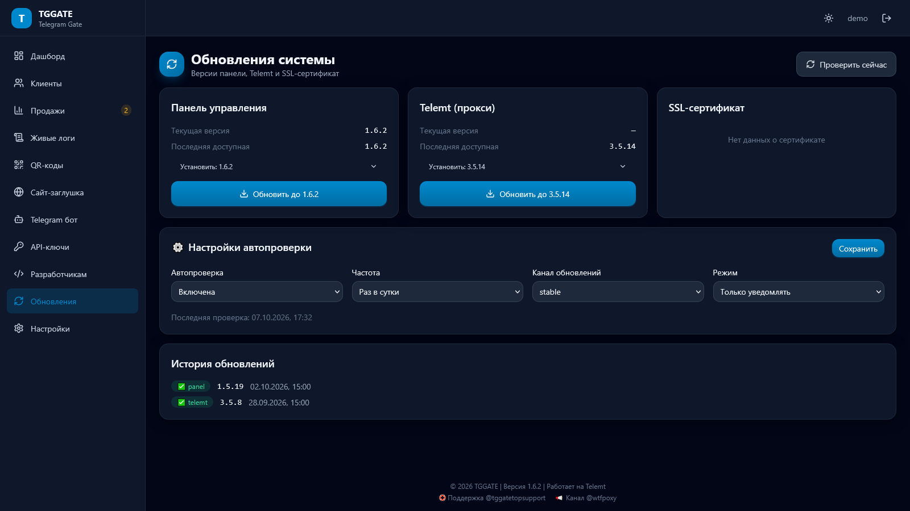
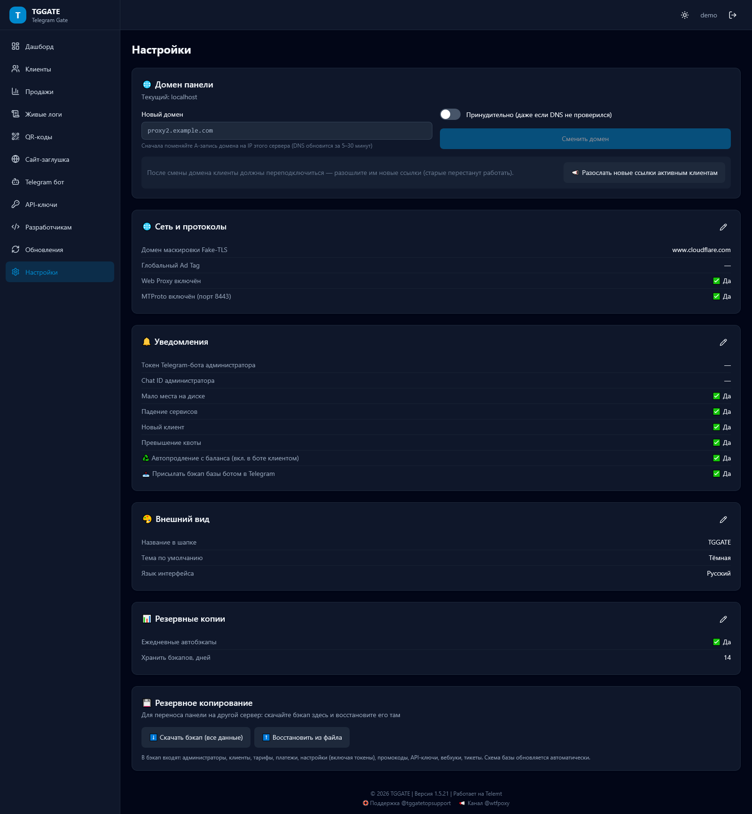

# 📸 Скриншоты панели TGGATE

Все скриншоты сняты на чистой панели с демо-данными (версия 1.6.2). Тёмная тема по умолчанию, есть и светлая.

## Вход

Чистый экран входа: логотип, логин и пароль администратора.

## Дашборд

Сводка в реальном времени: счётчики клиентов и ссылок, нагрузка CPU/RAM/сеть, живой график трафика, ожидающие платежи, активные подключения с IP и странами, статусы сервисов и SSL.

Та же страница в светлой теме — интерфейс полностью адаптирован.

## Клиенты

Таблица прокси: статус, онлайн-IP, трафик с прогресс-барами квот, срок, протоколы. Чекбоксы — массовые действия (продлить/включить/выключить). CSV-экспорт, создание, QR, редактирование, перевыпуск ссылок.

## Продажи и аналитика

Выручка по дням, топ тарифов по выручке, новые клиенты, воронка «тест → покупка» с конверсией. Фильтр периода: 7/30/90 дней, год.

## Живые логи

Подключения в реальном времени: время, клиент, IP, устройство (Windows/macOS/iOS/Android), протокол (пилюли Web/MTProto), статус. Фильтры, пауза, экспорт.

## QR-коды

Генерация QR для Web Proxy и MTProto любого клиента, отправка клиенту в Telegram.

## Сайт-заглушка

Файловый менеджер и редактор кода, готовые шаблоны (ремонт, авто, женский портал), SEO-поля. Домен выглядит как обычный сайт.

## Telegram-бот

Вверху — статистика продаж и список всех пользователей бота (с балансом и кнопками «Выдать прокси / Баланс / Написать»). Ниже: кастомные кнопки, основные настройки, подписка на канал, платёжные системы (CryptoBot, ЮKassa, карта, ⭐ Telegram Stars), тарифы списком с превью «Клиент увидит».

## API-ключи

Ключи для внешних интеграций с разделением прав и историей использования.

## Разработчикам

Документация публичного API, вебхуки и готовые примеры (cURL, Python, Node.js).

## Обновления

Версии панели и Telemt, живой статус-бар обновления по шагам, настройки автопроверки, история обновлений.

## Настройки

Компактные сводки «настройка → значение» с редактированием через модалки: домен панели (со сменой без переустановки), сеть и протоколы, уведомления, внешний вид, бэкапы.

## Публичная статус-страница

Открыта всем без входа: текущее состояние сервисов, полоски аптайма за 30 дней и блок «Ваше подключение» (IP, страна, устройство).
